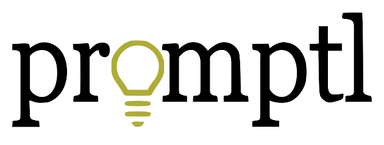

# Promptl



A gamified writing platform that makes writing fun for kids with learning differences.

🌐 **Live site:** [promptl.com](https://promptl.com)

## Overview

Promptl turns writing practice into a game. Originally built for the creator's younger sister — who has dyslexia and saw writing as a chore — it now helps any kind of writer build confidence through daily prompts, point streaks, and a private archive of their work.

## Key Features

🎲 **Random Prompts** — Each session generates 5 prompt words (a name, job, place, object, and bonus word) to inspire a story

⭐ **Point System** — Earn points based on prompt usage and story length:

- 10 points per regular prompt word used
- 20 points for the bonus word
- 25-point bonus for stories over 100 characters

🔥 **Daily Streaks** — Build a writing habit by writing on consecutive days

📝 **Real-Time Word Counter** — Track your progress as you type

📚 **Story Archive** — All your stories saved privately (only you can see them) with a clean read-back interface

🔐 **Secure Authentication** — Firebase Auth with email/password support and session-based login

## Tech Stack

- **Backend:** Python, Flask
- **Frontend:** HTML, CSS (custom design system), Vanilla JavaScript (ES modules)
- **Database:** Firestore (NoSQL, real-time)
- **Authentication:** Firebase Authentication
- **Deployment:** Render

## Architecture

```plaintext
┌─────────────────┐
│  Flask (Render) │  Serves HTML/CSS/JS, handles prompt generation + scoring,
└────────┬────────┘  verifies Firebase ID tokens, manages user sessions
         │
         ▼
┌─────────────────┐
│ Firebase Auth   │  Handles login/signup (email/password)
└─────────────────┘
         │
         ▼
┌─────────────────┐
│   Firestore     │  Stores users + their stories
└─────────────────┘
   users/{uid}
     ├── displayName, email, totalPoints, totalWords,
     │   currentStreak, lastStoryDate
     └── stories/ (subcollection)
          └── {storyId}/ → title, content, prompts, wordCount, pointsEarned
```

## Project Structure

```plaintext
promptl/
├── main.py                    # Flask app entry point + all routes
├── requirements.txt           # Python dependencies (Flask, firebase-admin, etc.)
├── render.yaml                # Render deployment config
├── .env                       # Local secrets (not committed)
├── static/
│   ├── styles.css             # Full design system (CSS variables, components)
│   ├── firebase-config.js     # Public Firebase web config (shared by templates)
│   ├── script.js              # Legacy JS helpers
│   └── assets/                # Logo, prompt icons, favicon
├── templates/
│   ├── template.html          # Base layout with nav + word count tracker
│   ├── landing.html           # Public marketing page
│   ├── login.html             # Firebase auth login
│   ├── signup.html            # Firebase auth signup
│   ├── index.html             # Home — prompt + writing form
│   ├── congrats.html          # Post-submit celebration page
│   ├── prior-pieces.html      # User's story archive
│   ├── read-story.html        # Single story read view
│   ├── my-account.html        # User stats (streak, points, words)
│   └── about.html             # About page
├── utils/
│   ├── database.py            # Firestore + Firebase Auth interactions
│   ├── model.py               # Word count + points calculation logic
│   └── prompts.py             # Random prompt generation from text files
└── text/                      # Word lists for prompts (names, jobs, places, etc.)
```

## Roadmap

- 🎓 **Teacher dashboard** — Let educators assign writing prompts and view their students' submissions
- 🏫 **School partnerships** — Special education-focused integrations
- 🔑 **Google sign-in** — One-click signup
- 🔄 **Password reset** — Self-serve recovery flow
- 📱 **Mobile app** — Native iOS/Android via SwiftUI/React Native

## Contact

Built by **Zoe Droulias**, McGill University Computer Science.

- 🌐 [Portfolio](https://zcoder365.github.io/PortfolioSite)
- 💼 [LinkedIn](https://www.linkedin.com/in/YOUR-LINKEDIN-HANDLE)
- 🐙 [GitHub](https://github.com/zcoder365)

---

*This project's source code is shared publicly for portfolio purposes. Please don't clone, redistribute, or self-host the code without permission.*
